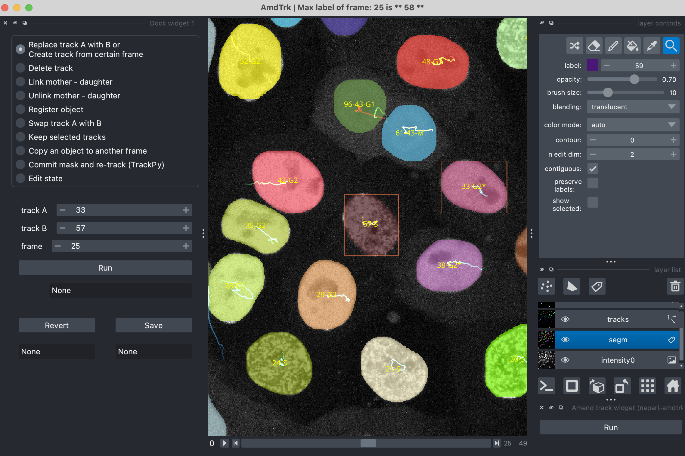

# Description

This plugin provides an interface to manually amend 2D segmentation and track (time-series images) within napari. It contains a reader to parse images and object tables in a file folder. Amended data can be saved through the plugin. The plugin aims to speed up data curation for quantitative analysis and labeling for the machine learning ground truth.

----------------------------------

Please visit out [GitHub hoempage](https://github.com/Jeff-Gui/napari-amdtrk-plugin) for quick start guide, sample data and detailed descriptions of the input data.

You can also find a demo video [here](https://drive.google.com/file/d/1oHPdYcKv-QgOWylm21DnOF1NlVNsRIcL/view).
