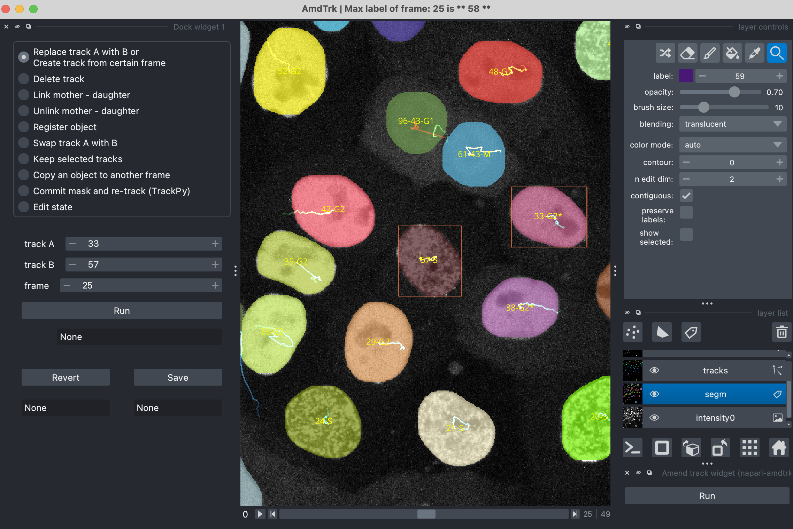

# napari-amdtrk

Amend segmentation and track within napari manually.

### [:eyes: watch a demo video](https://drive.google.com/file/d/1oHPdYcKv-QgOWylm21DnOF1NlVNsRIcL/view)

----------------------------------

### Input data structure

Napari-amdtrk reads an input directory which includes:
- An intensity image (`tif`) in txyc (or txy) format
- An object mask (`tif`) in txy format
- An object table (`csv`) with following essential columns:
    - frame: time frame
    - trackId: ID of the track, starting from 1
    - Center_of_the_object_0: x coordinate
    - Center_of_the_object_1: y coordinate
    - continuous_label: the corresponding label (intensity value) of the object in the object mask (You may use `skimage.measure.label` to get it from a binary mask.)

- A config file named `config.yaml` (_other names are not allowed_)

    Within the config file, there should be:
    - intensity_suffix: suffix of the intensity image (e.g., for `foo_GFP.tif`, use `GFP` in the config)
    - mask_suffix: suffix of the mask image
    - track_suffix: suffix of the tracked object table
    - frame_base: index of the first frame (either `0` or `1`)
    - stateCol: __optional__ column name for the cell state (e.g., cell cycle phase) in the object table. Leave blank if the object table does not contain it.

---
### Quick start

1. Open `napari` GUI.
2. `File` > `Open folder` > choose `Amend segmentation and track`
3. `Plugins` > `napari-amdtrk: Amend track widget` > `Run`
4. In `layer list`, select the `segm` layer to start editing.

Please check out the demo video [here](https://drive.google.com/file/d/1oHPdYcKv-QgOWylm21DnOF1NlVNsRIcL/view) and the sample data (see below).

----------------------------------

### Sample data

To load sample data, `File` > `Open Sample` > `napari-amdtrk` > `basic tracks` or `complete cell cycle tracks`.

- basic tracks: simple cell tracks as essential input data.
- complete cell cycle tracks: cell tracks with additional cell cycle features.

The above operations will download data to `~/.amd_trk/_sample_data/` (__~230MB__). After downloading is finished, sample data will be loaded.

_Notes_
- Please cite this repository if using the plugin in your work (try `About` > `Cite this repository` upper right of this homepage).
  
- Sample data (cell track videos) have been published with [_pcnaDeep: a fast and robust single-cell tracking method using deep-learning mediated cell cycle profiling_](10.1093/bioinformatics/btac602). We acknowledge Dr Kuan Yoow Chan and members of his lab for generating the data. 

----------------------------------

This [napari] plugin was generated with [Cookiecutter] using [@napari]'s [cookiecutter-napari-plugin] template.

<!--
Don't miss the full getting started guide to set up your new package:
https://github.com/napari/cookiecutter-napari-plugin#getting-started

and review the napari docs for plugin developers:
https://napari.org/stable/plugins/index.html
-->

## Installation

Please install `napari` GUI first:

    python -m pip install "napari[all]"

You can install `napari-amdtrk` via [pip]:

    pip install napari-amdtrk

## License

Distributed under the terms of the [MIT] license,
"napari-amdtrk" is free and open source software

## Issues

If you encounter any problems, please [file an issue] along with a detailed description.

[napari]: https://github.com/napari/napari
[Cookiecutter]: https://github.com/audreyr/cookiecutter
[@napari]: https://github.com/napari
[MIT]: http://opensource.org/licenses/MIT
[BSD-3]: http://opensource.org/licenses/BSD-3-Clause
[GNU GPL v3.0]: http://www.gnu.org/licenses/gpl-3.0.txt
[GNU LGPL v3.0]: http://www.gnu.org/licenses/lgpl-3.0.txt
[Apache Software License 2.0]: http://www.apache.org/licenses/LICENSE-2.0
[Mozilla Public License 2.0]: https://www.mozilla.org/media/MPL/2.0/index.txt
[cookiecutter-napari-plugin]: https://github.com/napari/cookiecutter-napari-plugin

[napari]: https://github.com/napari/napari
[tox]: https://tox.readthedocs.io/en/latest/
[pip]: https://pypi.org/project/pip/
[PyPI]: https://pypi.org/
